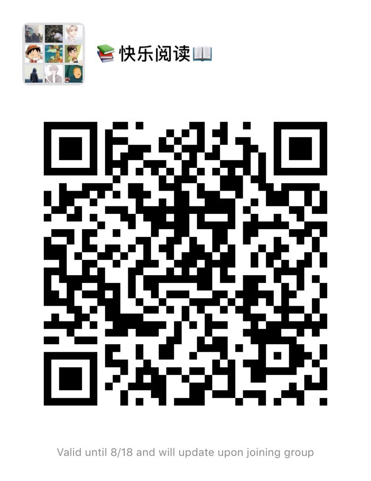

# 快乐阅读

目前每周分享一本精品电子书，后面视情况增加其他专题内容，周末发布。

欢迎分享精品书籍的各种电子版本或者纸质书，推荐或自荐文章/软件/资源，请[提交 issue](https://github.com/henrytien/HappyReading/issues) 。

建立初衷，我希望能和大家一起阅读精品书籍，后期我会每月送出一本纸质书籍，当他阅读完毕的时候或者不想看，送给喜欢此书的人，并告诉他，如果他不想看了或者看完之后，再送给另一位，当然电子书也可以多多分享给喜欢看书的人，也欢迎喜欢阅读的人加入微信群。

这个项目是我几年前看到一个故事，说一个小男孩帮助了别人，他什么也不要，但是别人希望以同样的方式去帮助别人，就是他最大的快乐。这也是我为什么这样去做的原因和动力。希望在手机时代人们花更多的时间阅读和思考！

:speaker: [公告] 如果你有纸质书籍或者电子书籍分享，欢迎与我联系（Email：cywzljylbq@gmail.com ）。

## 2019

**七月**：[第 1 期：乔布斯传](docs/0001.md) | [第 2 期：How to Become a Straight-A Student](docs/0002.md) 

### 微信群
欢迎加入**快乐阅读**微信群

### 分享
欢迎大家在群里分享或者这里提交，自己阅读到的喜欢的文段或是自己的读书笔记截图等。